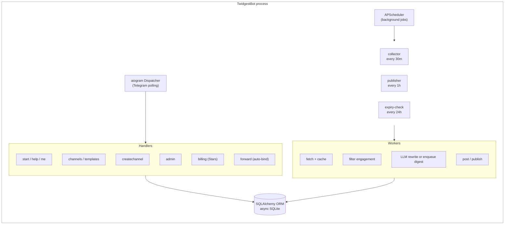

# TwidgestBot

Multi-tenant Telegram SaaS bot that turns curated X (Twitter) feeds into automatic Russian-language Telegram channels. Built as a solo-founder MVP demonstrating end-to-end SaaS architecture: payments, admin panel, AI-powered onboarding, and autonomous content workers.

Live bot: [@TwidgestBot](https://t.me/TwidgestBot)

---

## What it does

A user opens the bot, picks a topic (from 15 ready templates or describes their own), and gets a fully-automated Telegram news channel. The bot:

1. Fetches tweets from curated X accounts via [twitterapi.io](https://twitterapi.io)
2. Filters by engagement thresholds (likes, retweets, no-replies)
3. Runs each candidate through an LLM with niche-specific prompts and a Russian safety filter (no drugs, no dosages, no legally risky content)
4. Publishes either individual posts or periodic digests into the user's Telegram channel

All multi-tenant: one bot process serves many users, each with their own sources, channels, schedules, and subscription tier.

## Tech stack

- **Language:** Python 3.12, async/await throughout
- **Bot framework:** [aiogram 3.x](https://docs.aiogram.dev/)
- **Database:** SQLite + SQLAlchemy 2.0 (async)
- **Scheduler:** APScheduler (in-process)
- **LLM:** [OpenRouter](https://openrouter.ai/) — Claude Haiku 4.5 (default) and Claude Sonnet 4.5 (Pro tier)
- **Source:** [twitterapi.io](https://twitterapi.io/) with in-memory TTL cache
- **Payments:** Telegram Stars (XTR), subscription model with auto-renewal
- **Deployment:** systemd service on a single VPS

## Architecture

One process runs both the aiogram Telegram dispatcher (handling user commands in real time) and an APScheduler (running background workers). Everything shares a single async SQLAlchemy session factory.



## Key design decisions

**Multi-tenant from day one.** The data model is `User -> Channel -> ChannelSource`, not a single global config. A user can run 5 channels on different topics, each with its own sources, filters, niche prompts.

**Shared Twitter cache.** If 50 users monitor the same X account, `twitterapi.io` is called once per cycle, not 50 times. Simple in-memory TTL cache with per-username async locks to prevent cold-start thundering herd.

**Subscription billing via Telegram Stars.** Uses native Telegram `sendInvoice` with `subscription_period`, so auto-renewal just works. `XTR` currency, no Stripe/Paddle needed — critical for creators in regions where traditional payment rails aren't available.

**Safety-first content filter.** The LLM prompt explicitly rejects content that would be problematic under Russian law (military critique, drug references, specific medication dosages). Caught before posting, not after.

**Template + AI hybrid onboarding.** 15 curated templates for popular niches (AI, crypto, longevity, F1, NBA, etc.) give instant-start UX. If the topic isn't in the catalog, `/createchannel ai <description>` asks the LLM to suggest 12 relevant X accounts with one-line explanations for each.

## Project structure

```
twidgest-bot/
├── main.py              Entry point: dispatcher + scheduler
├── config.py            Env-based config
├── tiers.py             Pricing tiers (source of truth)
├── templates.py         15 built-in channel templates
├── niches.py            Per-niche prompt builders
│
├── bot/
│   ├── handlers/
│   │   ├── start.py     /start, /help, /me
│   │   ├── channels.py  /channels, /createchannel, /templates
│   │   ├── forward.py   Auto-bind channel on forwarded message
│   │   ├── admin.py     /admin grant|stats|user|broadcast
│   │   └── billing.py   /upgrade, Stars payment flow
│   └── middlewares/
│       └── admin_check.py
│
├── core/
│   ├── twitter_client.py  twitterapi.io wrapper
│   ├── twitter_cache.py   Shared TTL cache across users
│   ├── llm_client.py      OpenRouter with retry/backoff
│   └── safe_sender.py     Telegram send with auto-deactivation
│
├── db/
│   ├── models.py          SQLAlchemy models
│   ├── session.py         Async engine setup
│   └── repositories/
│       ├── users.py
│       ├── channels.py
│       ├── tweets.py
│       ├── billing.py
│       └── admin.py
│
└── workers/
    ├── collector.py       Fetch + filter + post/enqueue
    ├── publisher.py       Digest builder and publisher
    └── expiry_check.py    Daily tier downgrade
```

## Running locally

```bash
git clone https://github.com/kelbic/twidgest-bot.git
cd twidgest-bot

cp .env.example .env
# Fill in: TELEGRAM_BOT_TOKEN, TWITTER_API_KEY, OPENROUTER_API_KEY, ADMIN_USER_ID

python3 -m venv venv
source venv/bin/activate
pip install -r requirements.txt

python main.py
```

## Deploying as a systemd service

Copy `deploy/twidgest-bot.service` to `/etc/systemd/system/` and run:

```bash
systemctl daemon-reload
systemctl enable --now twidgest-bot
journalctl -u twidgest-bot -f
```

## What I learned building this

- **Shipping beats perfection.** The MVP reached production at roughly 3000 LOC across one focused weekend. Every architectural "nice to have" was deferred until a real user asked for it.
- **LLM as a quality filter, not a worker.** The LLM doesn't do the work — it evaluates whether a tweet deserves to exist in the channel. The hard engineering is everywhere else (dedup, rate-limits, quota enforcement, failure recovery, prompt hardening against jailbreaks).
- **Telegram Stars beats Stripe for certain audiences.** Native payment flow, no PCI compliance, no KYC for users, works globally out of the box. Perfect fit when your audience already lives inside Telegram.
- **Multi-tenant beats single-user from day one.** Refactoring a "my-personal-bot" into multi-tenant later is brutal. Start with `User -> Resource` even if you're the only user at launch — the cost up front is small, the cost of retrofitting is huge.

## License

MIT — see `LICENSE`.

## Author

[@kelbic](https://github.com/kelbic). Feedback and pull requests welcome.
