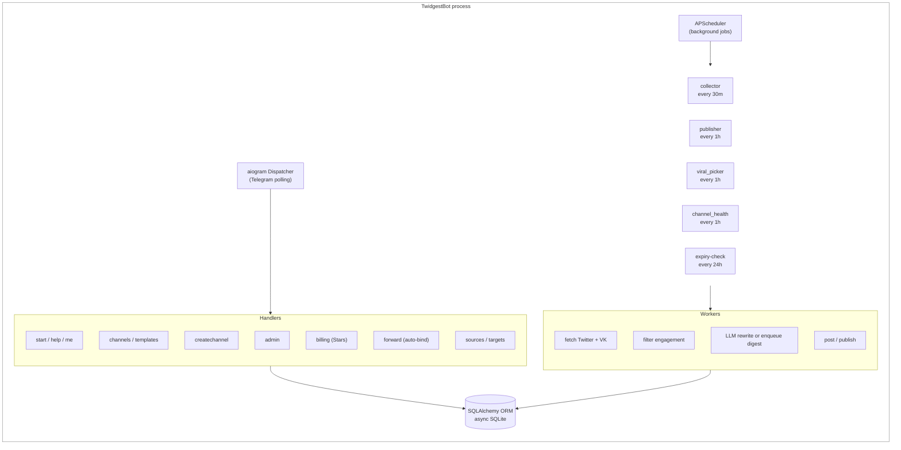

# TwidgestBot

Multi-tenant Telegram SaaS bot that turns curated X (Twitter) and VK feeds into automatic Russian-language Telegram channels. Built as a solo-founder MVP demonstrating end-to-end SaaS architecture: payments, admin panel, AI-powered onboarding, and autonomous content workers.


Live bot: [@TwidgestBot](https://t.me/TwidgestBot)

---

## What it does

A user opens the bot, picks a topic (from 15 ready templates or describes their own), and gets a fully-automated Telegram news channel. The bot:

1. Fetches posts from curated X (Twitter) accounts via [twitterapi.io](https://twitterapi.io) and VK communities via VK API
2. Filters by engagement thresholds (likes, retweets) — configurable per channel via `/setthreshold`
3. Runs each candidate through an LLM with niche-specific prompts and a Russian safety filter (no drugs, no dosages, no legally risky content)
4. Publishes either individual posts or periodic digests into the user's Telegram channel

All multi-tenant: one bot process serves many users, each with their own sources, channels, schedules, and subscription tier.

## Tech stack

- **Language:** Python 3.12, async/await throughout
- **Bot framework:** [aiogram 3.x](https://docs.aiogram.dev/)
- **Database:** SQLite + SQLAlchemy 2.0 (async)
- **Scheduler:** APScheduler (in-process)
- **LLM:** [OpenRouter](https://openrouter.ai/) — Llama 3.3 70B (default) and Claude Sonnet 4 (Pro tier)
- **Sources:** [twitterapi.io](https://twitterapi.io/) + VK API, both with in-memory TTL cache
- **Payments:** Telegram Stars (XTR), subscription model with auto-renewal
- **Deployment:** systemd service on a single VPS

## Architecture

One process runs both the aiogram Telegram dispatcher (handling user commands in real time) and an APScheduler (running background workers). Everything shares a single async SQLAlchemy session factory.



## Key design decisions

**Multi-tenant from day one.** The data model is `User -> Channel -> ChannelSource`, not a single global config. A user can run multiple channels on different topics, each with its own sources, filters, niche prompts.

**Dual source support: Twitter + VK.** Each `ChannelSource` has a `source_type` field (`twitter` or `vk`). Twitter sources use `@username`, VK sources use `vk:domain` format. Both are fetched in parallel each collector cycle. VK posts are already in Russian — a separate `build_vk_prompt()` skips translation and focuses on editing/shortening.

**Shared source cache.** If 50 users monitor the same X account or VK community, the API is called once per cycle, not 50 times. In-memory TTL cache with per-source async locks prevents thundering herd on cold start.

**Three-tier content filter.** Each channel has its own `filter_preset`:
- 🎯 `strict` — facts and events only, high bar (legacy alias: `news`)
- 📡 `loose` — news, reactions, community posts (legacy aliases: `community`, `entertainment`)
- ⚡ `unfiltered` — publishes everything except legally risky content; engagement thresholds auto-zeroed; user opt-in with ToS disclaimer; digest published without LLM filtering

Admins can override any channel's filter via `/admin setfilter CHANNEL_ID PRESET`.

**Configurable engagement thresholds.** Each channel has `min_likes` and `min_retweets` settings, configurable via `/setthreshold`. For `unfiltered` channels, thresholds are automatically ignored. Admins can override via `/admin setthreshold`.

**Subscription billing via Telegram Stars.** Uses native Telegram `sendInvoice`. `XTR` currency, no Stripe/Paddle needed — critical for creators in regions where traditional payment rails aren't available.

**Free trial model.** New users get 30 days of full Free-tier access. After expiry, posting stops and users are prompted to upgrade to Pro (2999 ⭐/month).

**Safety-first content filter.** The LLM prompt explicitly rejects content that would be problematic under Russian law (military critique, drug references, specific medication dosages). Caught before posting, not after. The `unfiltered` preset bypasses quality filtering but retains all safety rules.

**Template + AI hybrid onboarding.** 15 curated templates for popular niches (AI, crypto, longevity, F1, NBA, etc.) give instant-start UX. If the topic isn't in the catalog, `/createchannel ai <description>` asks the LLM to suggest 12 relevant X accounts with one-line explanations for each.

## Pricing

| Tier | Price | Sources | Channels | Posts/day |
|------|-------|---------|----------|-----------|
| Free (trial) | Free, 30 days | 10 | 3 | 50 |
| Pro | 2999 ⭐/month | 10 | 3 | 50 + Claude LLM |

## Project structure
twidgest-bot/
├── main.py              Entry point: dispatcher + scheduler
├── config.py            Env-based config (incl. VK_ACCESS_TOKEN)
├── tiers.py             Pricing tiers (source of truth)
├── templates.py         15 built-in channel templates
├── prompts.py           LLM prompts + filter mode definitions
├── engagement_defaults.py  Per-niche engagement defaults
│
├── bot/
│   ├── handlers/
│   │   ├── start.py     /start, /help, /me
│   │   ├── channels.py  /channels, /createchannel, /templates
│   │   ├── sources.py   /sources, /addsource, /removesource,
│   │   │                /setfilter, /setthreshold, /filters
│   │   ├── targets.py   Target channel management
│   │   ├── forward.py   Auto-bind channel on forwarded message
│   │   ├── admin.py     /admin grant|stats|user|broadcast|
│   │   │                setfilter|setthreshold|addsource|removesource
│   │   └── billing.py   /upgrade, Stars payment flow
│   └── middlewares/
│       ├── admin_check.py
│       └── rate_limit.py
│
├── core/
│   ├── twitter_client.py  twitterapi.io wrapper
│   ├── twitter_cache.py   Shared TTL cache across users
│   ├── vk_client.py       VK API client (wall.get, groups.search)
│   ├── llm_client.py      OpenRouter with retry/backoff
│   ├── safe_sender.py     Telegram send with auto-deactivation
│   ├── image_picker.py    Unsplash image fetcher
│   └── topic_dedup.py     Duplicate detection
│
├── db/
│   ├── models.py          SQLAlchemy models
│   ├── session.py         Async engine setup
│   └── repositories/
│       ├── users.py       incl. 30-day trial logic
│       ├── channels.py
│       ├── tweets.py
│       ├── billing.py
│       └── admin.py
│
└── workers/
├── collector.py       Fetch Twitter+VK, filter, post/enqueue
├── publisher.py       Digest builder and publisher
├── viral_picker.py    Picks top posts for hybrid mode
├── channel_health.py  Channel health checks
└── expiry_check.py    Daily tier downgrade + trial expiry

## Running locally

```bash
git clone https://github.com/kelbic/twidgest-bot.git
cd twidgest-bot

cp .env.example .env
# Fill in: TELEGRAM_BOT_TOKEN, TWITTER_API_KEY, OPENROUTER_API_KEY,
#          ADMIN_USER_ID, VK_ACCESS_TOKEN (optional)

python3 -m venv venv
source venv/bin/activate
pip install -r requirements.txt

python main.py
```

## Deploying as a systemd service

Copy `deploy/twidgest-bot.service` to `/etc/systemd/system/` and run:

```bash
systemctl daemon-reload
systemctl enable --now twidgest-bot
journalctl -u twidgest-bot -f
```

## What I learned building this

- **Shipping beats perfection.** The MVP reached production at roughly 3000 LOC across one focused weekend. Every architectural "nice to have" was deferred until a real user asked for it.
- **LLM as a quality filter, not a worker.** The LLM doesn't do the work — it evaluates whether content deserves to exist in the channel. The hard engineering is everywhere else (dedup, rate-limits, quota enforcement, failure recovery).
- **Dual-source architecture pays off early.** Adding VK alongside Twitter required touching 7 files but zero breaking changes — because `ChannelSource` was already abstracted from the start with a `source_type` field.
- **Telegram Stars beats Stripe for certain audiences.** Native payment flow, no PCI compliance, no KYC for users, works globally out of the box.
- **Multi-tenant beats single-user from day one.** Refactoring a "my-personal-bot" into multi-tenant later is brutal. Start with `User -> Resource` even if you're the only user at launch.
- **Keep a session document.** When working with AI assistants across multiple sessions, a `VK_INTEGRATION.md` plan file saved hours — the next session picked up exactly where the last one left off.

## License

MIT — see `LICENSE`.

## Author

[@kelbic](https://github.com/kelbic). Feedback and pull requests welcome.
